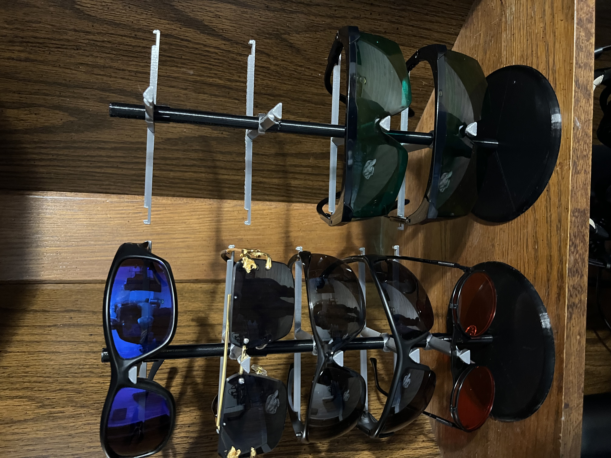

# A Multi-Glasses Stand 

I made this for managing and displaying glasses.

## Description

This was made in AutoDesk Fusion 360 and is free for personal use.

## Getting Started

### Dependencies

* To print this you need a 3d printer slicer, you do not need to use supports.  
  

### Using

* There are three parts
  * The clips keep the holders in place
  * The stand is the black rod
  * The holder fits down and slides down the stand

## Authors

Matthew Rogers  
[@rogerscissp](https://twitter.com/rogerscissp)

## Version History

* 0.1
    * Initial Release

## License

This project is licensed under the [NAME HERE] License - see the LICENSE.md file for details

## Acknowledgments

Inspiration, code snippets, etc.
* NA
