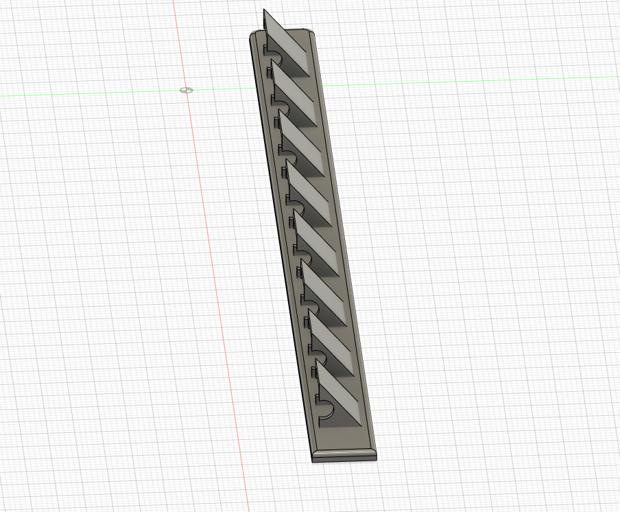

# A Multi-Wire Hook for my Office 🗄️

I made this for hanging 🪝 USB cables  in my office on the side of some shelving. 

## Description

This was made in AutoDesk Fusion 360 and is free for personal use.

## Getting Started

### Dependencies

* To print this you need a 3d printer slicer, you do not need to use supports.  The f3d file is the direct export, you can edit that easily in AutoDesk Fusion 360.

### Using

* Slice this file in your printer. It's approximately 170mm x 20mm.
* Print time is 52 minutes on my Flashforge Artemis. 

## Authors

Matthew Rogers  
[@rogerscissp](https://twitter.com/rogerscissp)

## Version History

* 0.1
    * Initial Release

## License

This project is licensed under the [NAME HERE] License - see the LICENSE.md file for details

## Acknowledgments

Inspiration, code snippets, etc.
* NA
